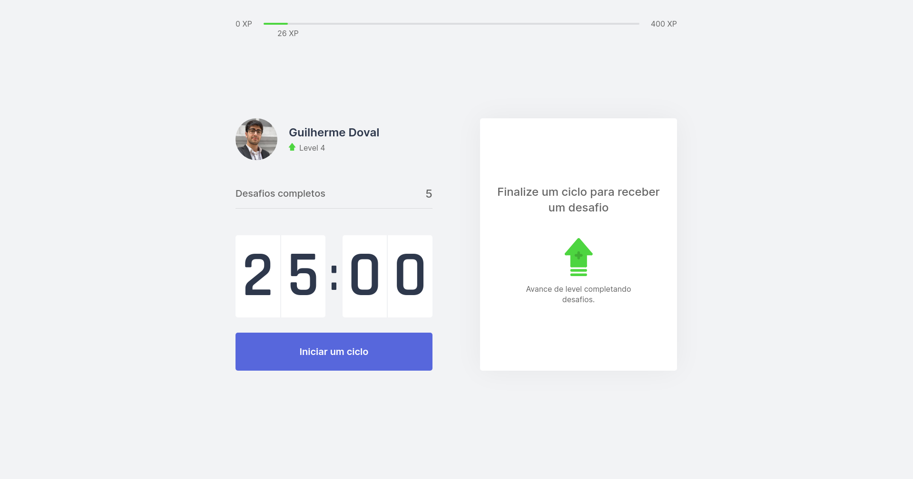
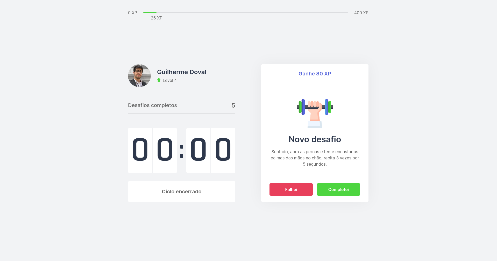

<h1 align="center">
  
</h1>

## 📋 Sobre

Moveit é uma ferramenta de produtividade voltada para devs e outros profissionais que passam muito tempo na frente de seus PCs.

Inspirada na [técnica do pomodoro](https://pt.wikipedia.org/wiki/T%C3%A9cnica_pomodoro), moveit estimula que os usuários façam diversos exercícios ao fim de cada sessão.

Desenvolvido durante a Next Level Week #4 da [Rocketseat](https://rocketseat.com.br/), esse projeto foi de grande aprendizado principalmente sobre a utilização da Context API do React e também aprofundou meus conhecimentos sobre o NextJS da Vercel, que se tornou o meu framework de escolha quando trabalhando com React.


---

## 🧰 Tecnologias utilizadas
O projeto foi desenvolvido utilizando as seguintes tecnologias:

- [ReactJS](https://reactjs.org/)
- [NextJS](https://nextjs.org/)

---

## 📷 Screenshots






---

## 📁 Como baixar o projeto

```bash
  # Clonar repositório git
  $ git clone https://github.com/Dovalization/moveit.git

  # Entrar na pasta do projeto
  $ cd moveit

  # Instalar dependências
  $ yarn install

  # Gerar build do projeto com o Next
  $ yarn build

  # Rodar servidor Next
  $ yarn start
```
